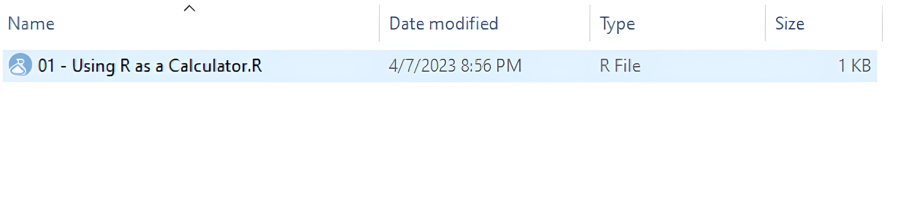
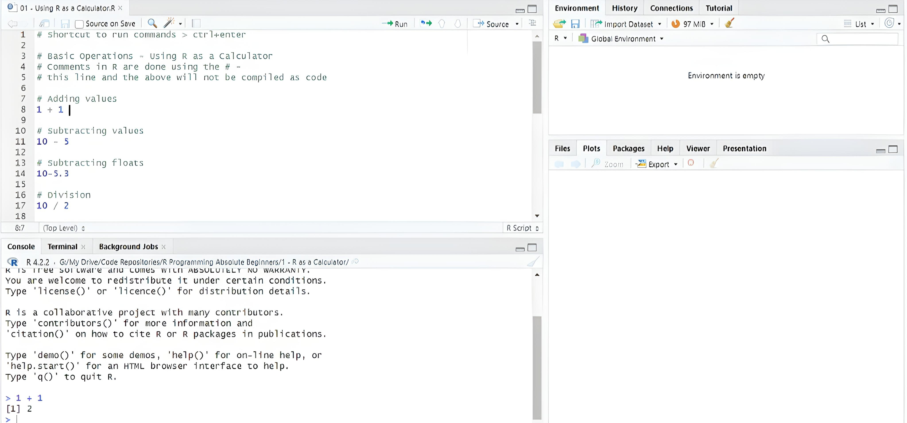
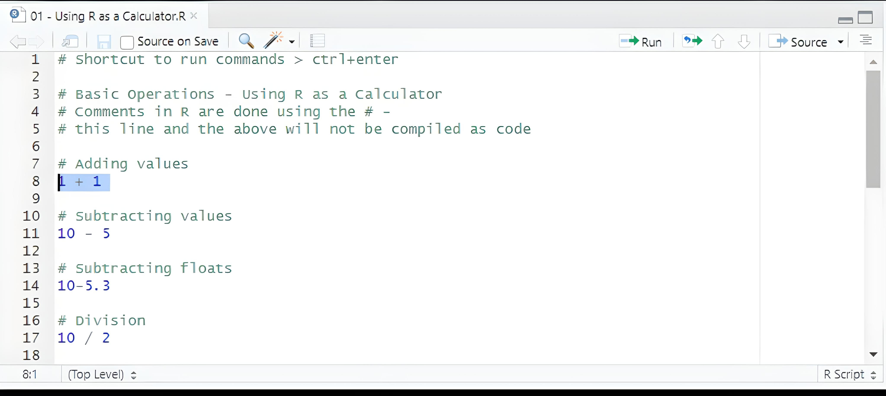

# 📚 R Programming for Absolute Beginners 👨‍🎓👩‍🎓

Welcome to the world of R programming! 🚀

## Introduction
R is not just a programming language; it's a powerful environment for statistical computing and data analysis. It offers a wide array of statistical and graphical tools, making it indispensable for researchers, analysts, and businesses worldwide. Best of all, it's open-source, so anyone can use and customize it to their needs.

## 📦 Get Started
This repository is your gateway to mastering R from the ground up. Whether you're an absolute beginner or looking to enhance your skills, we've got you covered. We'll delve into key topics, including:

### R as a Calculator 🖩
Why use a regular calculator when you can use R? Learn how to harness R's power for basic and complex arithmetic operations, making calculations a breeze.

### Vectors ➡️
Explore the fundamentals of R by getting acquainted with vectors. These 1-dimensional arrays are your building blocks for storing and manipulating data of various types.

### Data Types 📊
R offers a diverse set of data types, from integers to dates, making it versatile for handling complex data sets.

### Arrays ♾️
Step up your data manipulation game with arrays, capable of handling multidimensional data effortlessly.

### Matrices 👩‍💻
Dive into linear algebra with matrices. Perform operations like multiplication, inversion, and eigenvalue decomposition.

### Data Frames 📙
Master data frames, a vital tool for working with data in a tabular format, much like spreadsheets or tables.

### Lists 📜
Discover the versatility of lists, capable of storing data of different types and nesting to any depth.

### Libraries 📚
Unlock the potential of R with its extensive library ecosystem, covering data manipulation, visualization, machine learning, and statistics.

### Working with Data Frames 📙
Delve deeper into data frames, the cornerstone of data analysis in R. Learn filtering, sorting, grouping, summarizing, and data visualization using ggplot2.

### Reading External Files 📂
Master the art of importing and exporting data from various file formats like CSV, Excel, and SQL databases.

### Functions 🧩
Explore the power of functions, building blocks of R programming. Define, call, and pass arguments to functions and leverage built-in functions.

## 📖 Your Learning Journey
These materials serve as the foundation for lvo Bernadro book, "R Programming: R Language for Absolute Beginners," available for purchase on   
[Amazon](https://www.amazon.com/Programming-Language-Absolute-Beginners/dp/B0BQ94N9L7) 📦  
[Gumroad](https://ivopbernardo.gumroad.com/l/rlanguagebeginners) 📚  
 (in PDF format).   Additionally, you can find in-depth explanations in  Udemy course.

## 🚀 Get Started
To embark on your R programming journey, follow these simple steps:

1. #### Download R Base: 
   Install R on your computer. You can download it [here](https://cran.r-project.org/mirrors.html).

2. #### Get R Studio:  
   We recommend using R Studio as your integrated development environment (IDE). Download it [here](https://www.rstudio.com/products/rstudio/download/).

3. #### Running the Materials:  
   Open any script in the course materials, like "1 - R as a Calculator\01 - Using R as a Calculator.R,"  
by double-clicking it. This will launch R Studio.

4. #### Execute Code:   
   Select the code you want to run, hit the Run button or press CTRL + Enter (Windows) or CMD + Enter (Mac), and see your code's result in the command line window.

## 👨‍💻 About the author:

### Usama Munawar

## 📧 Connect with me on social media

 
 

Happy coding! 📬
